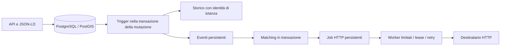

# Implementazione e verifiche — 22 settembre 2026

Questa iterazione implementa le fondamenta del piano per IoT ad alto volume.
Non conclude tutti i work package W00–W11 e non costituisce una certificazione NGSI-LD.
Il broker e il database preesistenti in esecuzione non sono stati aggiornati.

## Architettura effettiva



I trigger danno una garanzia comune anche ai percorsi batch e alle cancellazioni.
È una scelta implementativa rispetto al servizio applicativo proposto negli ADR:
il nucleo della transazione oggi è nel database, non in un nuovo microservizio.
I job sono unici per evento e sottoscrizione. Il commit della materializzazione
salva insieme job e avanzamento dell'evento. Un retry riutilizza il payload e l'ID.
Un crash dopo l'accettazione HTTP ma prima del commit può produrre un duplicato:
la garanzia è at-least-once, non exactly-once.

Le lease durano 30 secondi; una richiesta HTTP ha timeout di 10 secondi. Dopo
12 tentativi falliti il job rimane consultabile in stato `dead`. Anche gli eventi
non materializzabili hanno retry e conservano payload/errore dopo l'esaurimento
dei tentativi. L'ordinamento è conservato per entità nella materializzazione e
per endpoint nella consegna. Un destinatario fermo blocca i propri job successivi,
mentre altri endpoint possono avanzare.

## Verifiche eseguite

Database separato: container `athena-implementation-test-db`, PostgreSQL 16/PostGIS
3.4, porta localhost:55432, database `athena_test`. Mac ARM con immagine database
amd64 emulata. Nessuna misura dimensiona una produzione reale.

La suite `storage_integration` esercita i repository e il router effettivi:

- migrazioni ripetibili e con checksum;
- errore batch con rollback di un elemento, conservazione degli altri e assenza
  di storico/eventi fantasma;
- commit atomico entità, storico ed eventi, compreso rollback di DELETE;
- SQL con valori eterogenei e nome geoproperty ostile;
- merge e cancellazione per dataset, senza moltiplicare lo storico delle istanze immutate;
- filtri `q` sulle istanze multiple;
- storico senza entità corrente, Relationship, createdAt, modifiedAt, lastN;
- conteggi JSON interi, aggregazioni multiple, modifica/cancellazione istanze;
- recupero evento senza segnale in memoria, HTTP 503 seguito da retry riuscito,
  recupero lease scaduta e mantenimento dell'ID di notifica;
- blocco delle risposte DNS private nel client HTTP;
- isolamento persistente di un evento non elaborabile dopo 12 tentativi;
- media negotiation, espansione di type/q, readiness e metriche del router.

Le unit test verificano inoltre round-trip JSON-LD con contesto personalizzato e
GeoProperty, compilatore SQL, parser e controlli URI/IP. I vecchi test che copiavano
le implementazioni sono archiviati e non vengono conteggiati come copertura.

## Prima misura riproducibile dei componenti

Comando: `cargo test --locked --release --test iot_benchmark -- --ignored --nocapture`.
500 entità per fase, un attributo, batch di 100, singolo processo, database locale.
Storico e outbox sempre attivi; verificati 1501 eventi e 1501 righe storiche.

| Operazione | Risultato della prima esecuzione |
| --- | ---: |
| Create individuale, sequenziale | 1058 entità/s |
| Latenza create individuale p50 / p95 | 0,73 / 1,70 ms |
| Create bulk | 4651 entità/s |
| Upsert bulk | 3899 entità/s |
| Normalizzazione JSON-LD con cache calda | 2035 documenti/s |
| Normalizzazione con processore nuovo a ogni documento | 740 documenti/s |

Il rapporto bulk/singolo riguarda lo stesso nuovo storage e le stesse garanzie.
Il rapporto JSON-LD misura l'effetto della cache del contesto processato. Non sono
un confronto prima/dopo con il broker originale, né un benchmark HTTP completo,
né una comparazione con Orion-LD, Scorpio o Stellio. Manca ancora uno stress test
prolungato con fan-out, payload realistici, concorrenza, riavvii di processo e
misure CPU/RAM/WAL/ritardo storico e notifiche.

## Fonti e artefatti

- [ETSI GS CIM 009 V1.9.1](https://www.etsi.org/deliver/etsi_gs/CIM/001_099/009/01.09.01_60/gs_CIM009v010901p.pdf).
- [Contesto normativo ETSI, allegato B](https://cim.etsi.org/NGSI-LD/official/annex-b.html),
  incorporato in `crates/athena-jsonld/contexts/core-v1.9.jsonld`; l'endpoint
  uri.etsi.org ha risposto 403 durante il download.
- [Processore json-ld 0.21.4](https://docs.rs/json-ld/0.21.4/json_ld/), fissato nel lockfile.
- Contesto W3C transitivo: https://w3id.org/security/data-integrity/v2, incorporato
  per consentire elaborazione offline del core ETSI.

Il contenuto dei contesti è conservato come dato di interoperabilità; la presenza
nel processore non implica supporto applicativo a tutte le feature che nominano.

## Operazioni e limiti

`/health` misura la vita del processo; `/ready` verifica database e versione di
schema; `/metrics` espone contatori HTTP e arretrati. Lo storage usa statement
timeout 15 s e lock timeout 5 s. L'admission control limita richieste e arretrati,
con campionamento ogni secondo: è un limite operativo approssimato, non una quota
transazionale esatta. Non cancella scritture già confermate.

Per diagnosticare le consegne fallite:

```sql
SELECT id, subscription_id, attempts, last_error
FROM notification_jobs WHERE status = 'dead' ORDER BY created_at;
SELECT id, entity_id, attempts, last_error
FROM entity_events WHERE processed_at IS NOT NULL AND last_error IS NOT NULL;
```

Dopo aver risolto la causa, un operatore può riaccodare un job specifico conservando
il suo ID: impostare status='pending', attempts=0, available_at=now(), lease_token=NULL,
lease_until=NULL. Non riaccodare indiscriminatamente tutti i job senza valutare
l'idempotenza del destinatario. Gli eventi non elaborabili richiedono la correzione
della causa e il ripristino di processed_at=NULL, attempts=0, lease_until=NULL.

Retention, partizionamento, autenticazione/tenant, calendario temporale, piena
federazione, MQTT e conformità integrale restano lavori aperti. Prima di installare
questa versione su dati esistenti occorre provare la migrazione su un ripristino:
le vecchie versioni non conservavano il contesto semantico, e il supporto di lettura
ai nomi legacy non può ricostruire ontologie perdute.

## Esito dei controlli di sviluppo

`cargo test --locked --workspace`: 27 test passati; le due suite che richiedono
PostgreSQL/benchmark sono escluse dal run ordinario e lanciate esplicitamente.
`cargo test --locked --test storage_integration -- --ignored --nocapture`: passato.
`cargo fmt --all --check`: passato. `cargo clippy --workspace --all-targets`:
completato con suggerimenti di stile, senza errori. SQLx 0.7.4 segnala una futura
incompatibilità del toolchain da gestire nell'aggiornamento delle dipendenze.
La configurazione CI è aggiunta, ma non è stata eseguita da un servizio CI remoto.
