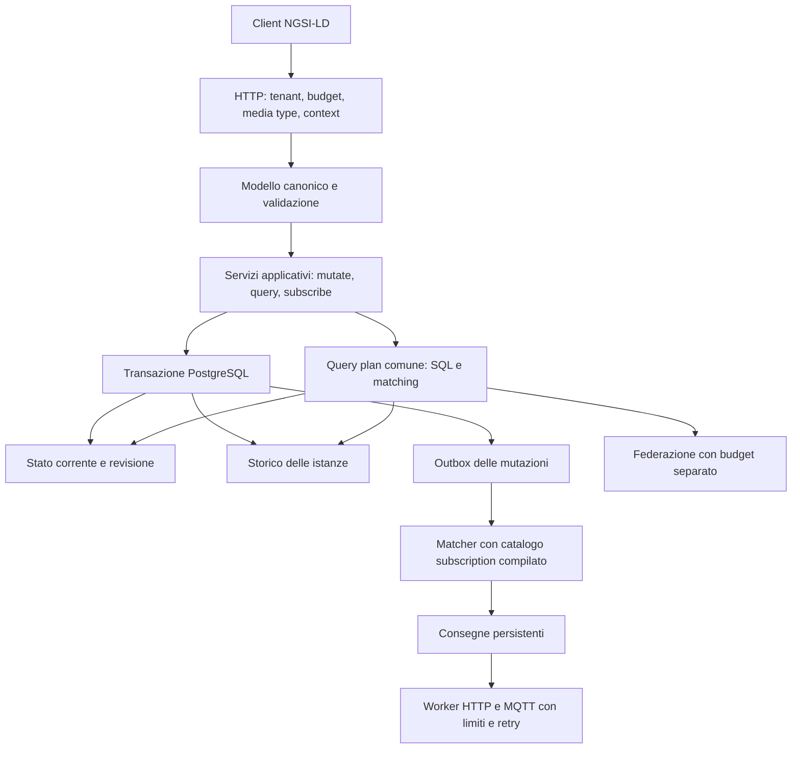

# Athena: piano architetturale per IoT ad alto volume

Data: 22 settembre 2026. Stato: proposta, senza modifiche al codice applicativo.

La priorità indicata è **scritture, storico e notifiche ad alto volume**, mantenendo un percorso esplicito verso una copertura NGSI-LD ampia e verificabile. Hardware di produzione, volume reale, retention, numero di subscription e budget non sono ancora specificati: i valori di carico sotto sono scenari di prova, non capacità dimostrate.

**Raccomandazione:** conservare Rust/Tokio/Axum e PostgreSQL/PostGIS; introdurre un modello NGSI-LD canonico, un servizio unico per le mutazioni e una transazione che persista stato corrente, storico abilitato ed evento da notificare. Rendere poi matching e consegna delle notifiche durevoli, limitati nella concorrenza e scalabili separatamente. Ottimizzare le scritture sulla base di misure riproducibili.

Documenti collegati: [matrice delle feature](matrice-ngsi-ld-2026-09-22.md), [decisioni architetturali proposte](decisioni-2026-09-22.md), [verifiche eseguite](verifiche-2026-09-22.md).

## 1. Stato del progetto e riferimento normativo

Il workspace contiene sei crate: `athena-model`, `athena-jsonld`, `athena-query`, `athena-storage`, `athena-subscription`, `athena-api`. Il processo principale costruisce repository e servizi, esegue gli script SQL e avvia HTTP. Lo storage usa JSONB per gli attributi correnti, una colonna PostGIS per `location`, tabelle dedicate per storico, subscription e registrazioni. La separazione iniziale è utile; manca un livello applicativo che governi le operazioni attraverso tutti questi componenti.

Il README dichiara conformità completa v1.8.1+, MQTT, retry e prestazioni molto elevate. Il codice e le verifiche raccolte non supportano queste dichiarazioni nella loro interezza. Non attribuisco una percentuale di conformità: serve un inventario di requisiti con test e denominatore espliciti.

Come obiettivo stabile propongo **ETSI GS CIM 009 v1.9.1**, pubblicata nel luglio 2025, mantenendo un profilo di compatibilità v1.8.1 per i client esistenti. Al controllo del 22 settembre 2026, TS 104 175 e TS 104 176 risultano ancora draft 0.9.6 registrati per la pubblicazione: monitorarli separatamente, evitando di mescolare requisiti di versioni diverse. Fonti: [GS CIM 009 v1.9.1](https://www.etsi.org/deliver/etsi_gs/CIM/001_099/009/01.09.01_60/gs_CIM009v010901p.pdf), [stato TS 104 175](https://portal.etsi.org/webapp/WorkProgram/Report_WorkItem.asp?WKI_ID=74870), [stato TS 104 176](https://portal.etsi.org/webapp/WorkProgram/Report_WorkItem.asp?WKI_ID=74871).

## 2. Evidenze che determinano le priorità

`V` = verificato eseguendo comandi o richieste; `C` = osservato direttamente nel codice; `I` = conseguenza tecnica da riprodurre in test isolato. I numeri di riga si riferiscono allo snapshot analizzato.

| ID | Priorità | Evidenza | Impatto e intervento |
|---|---|---|---|
| E01 | P0 | V: `cargo test --workspace` non compila `verification_test`; include file interni che dipendono da `thiserror`, assente fra le dipendenze del package radice. [Test](../../tests/verification_test.rs), riga 4. | Ripristinare il gate di build facendo usare ai test le API dei crate reali. |
| E02 | P0 | V: 13 test unitari dei crate passano, uno fallisce sul testo SQL atteso; API e storage hanno zero unit test. [Query test](../../crates/athena-query/src/lib.rs), riga 94. | La differenza di parentesi non dimostra SQL errato. Servono test semantici su PostgreSQL/PostGIS e HTTP. |
| E03 | P0 | C: `geoproperty` arriva come stringa libera e viene interpolato in SQL. [Compiler](../../crates/athena-query/src/sql_compiler.rs), riga 52; [parser](../../crates/athena-query/src/geo_parser.rs). | Superficie di SQL injection: parametrizzare anche i percorsi JSON; verificare con test isolati, senza eseguire exploit sull'istanza corrente. |
| E04 | P0 | C: subscription e dispatcher non invocano la validazione SSRF; il resolver usa `reqwest::get`; il controllo per la federazione usa DNS sincrono e non vincola la connessione all'IP verificato. [Security](../../crates/athena-api/src/security.rs), [dispatcher](../../crates/athena-subscription/src/dispatcher.rs). | Un unico client di uscita con policy per DNS, redirect, IPv4/IPv6, timeout e dimensioni. Ridurre anche i blocchi del runtime async. |
| E05 | P0 | C: nessun handler consuma `RequestContext` o chiama il resolver; il middleware aggiunge sempre il core context. V: `Accept: application/ld+json` riceve `application/json`. [Middleware](../../crates/athena-api/src/middleware.rs), [entities](../../crates/athena-api/src/handlers/entities.rs). | Le chiavi compatte sono usate come identità degli attributi: contesti diversi possono produrre dati semanticamente incoerenti. Integrare espansione, validazione e compattazione. |
| E06 | P0 | C: gli attributi sono `Value`; create accetta oggetti/array senza verificarne tutta la struttura. PATCH fa merge JSONB superficiale e può persistere `@context` fra gli attributi. [Model](../../crates/athena-model/src/entity.rs), [store](../../crates/athena-storage/src/entity_store.rs), riga 256. | Modellare operazioni distinte e istanze per dataset; mantenere invarianti anche negli aggiornamenti parziali. |
| E07 | P0 | C: i batch condividono una transazione, catturano errori SQL e continuano senza savepoint. [Entity store](../../crates/athena-storage/src/entity_store.rs), riga 348. I: dopo un errore SQL i successi accumulati possono non corrispondere a dati committati. | Correggere risultati parziali e rollback prima di aumentare il throughput. |
| E08 | P0 | C: `record_temporal_instance` viene chiamato solo dal percorso temporale esplicito. [Temporal store](../../crates/athena-storage/src/temporal_store.rs), riga 59. | Le normali mutazioni non alimentano lo storico. Definire e implementare la storicizzazione automatica del profilo IoT. È una scelta di prodotto, non un obbligo universale attribuito allo standard. |
| E09 | P0 | C: l'evento viene inviato a un canale RAM dopo il commit; errore di lettura subscription scarta l'evento. Delete entity e batch delete non producono eventi; batch update/upsert notificano il payload ricevuto. [Engine](../../crates/athena-subscription/src/engine.rs), [batch](../../crates/athena-api/src/handlers/batch.rs). | Possibili perdite e notifiche con stato incompleto. Outbox atomica e evento con operazione, revisione e dati corretti. |
| E10 | P0 | C: PK temporale `(entity_id, attribute_id, observed_at)`, esclusi dataset e instanceId; su conflitto viene sovrascritto il valore. Tutto è ricostruito come `Property`. [Schema](../../crates/athena-storage/migrations/0002_temporal_hypertable.sql), [store](../../crates/athena-storage/src/temporal_store.rs), riga 95. | Due sensori/dataset allo stesso istante possono collidere; Relationship e metadati perdono semantica. Ridisegnare identità e rappresentazione temporale. |
| E11 | P0 | V: `timeproperty=createdAt` restituisce 500 perché manca la colonna; `timeproperty=modifiedAt&lastN=1` restituisce 500 perché la sottoquery non espone la colonna richiesta. C: COUNT viene decodificato come `Option<f64>` con `row.get`. [Store](../../crates/athena-storage/src/temporal_store.rs), righe 135, 196, 233. | Correggere schema/query e decoding fallibile. I: mismatch COUNT/BIGINT può causare panic; `panic=abort` in release amplia l'impatto. |
| E12 | P1 | C: ogni evento ricarica tutte le subscription; parsing di `q` e regex ripetuti; `worker_threads` inutilizzato; un `spawn` per destinatario. [Engine](../../crates/athena-subscription/src/engine.rs), righe 25–54. | Costo proporzionale a eventi × subscription, carico DB e concorrenza non limitata. Catalogo indicizzato e compilato, code persistenti e worker con budget. |
| E13 | P1 | C: `geoQ` e `timeInterval` sono memorizzati ma non applicati dal matcher; `q` non valido può essere ignorato. `last_notification` è aggiornato in una colonna non riletta nel modello; il dispatcher fa un solo POST HTTP. | Completare validazione, scheduling, throttling concorrente, retry e MQTT. Non classificare un campo deserializzato come feature implementata. |
| E14 | P1 | C: query temporale multi-entità seleziona ID con join sullo stato corrente, poi esegue una query per ID e ignora alcuni errori. `lastN` limita tutte le righe insieme; `aggrPeriodDuration` non viene usato. [Store](../../crates/athena-storage/src/temporal_store.rs), riga 305. | Storico indipendente dalla vita dell'entità corrente, query in insieme, limiti per serie/dataset e aggregazioni corrette. |
| E15 | P1 | C: il compilatore usa estrazioni e cast JSONB, mentre l'indice è GIN `jsonb_path_ops`; `near` converte `location` in geography, mentre il GiST è su geometry. | L'esistenza degli indici non prova che questi piani li usino. Misurare con EXPLAIN; aggiungere solo indici/proiezioni utili e quantificare il costo sulle scritture. |
| E16 | P1 | C: batch eseguiti riga per riga; gli update singoli fanno poi un'altra SELECT; filtro `attrs` applicato dopo aver letto tutto il JSONB. [Entity store](../../crates/athena-storage/src/entity_store.rs), [handlers](../../crates/athena-api/src/handlers/attrs.rs). | Ridurre round trip con RETURNING e operazioni SQL in insieme, preservando la semantica e l'isolamento. |
| E17 | P1 | C: federazione chiamata con query string `None`; richieste remote senza filtri; merge lineare, limite applicato solo localmente e count solo locale. Discovery esamina al massimo le prime 100 registrazioni per il clamp interno. [Federation](../../crates/athena-api/src/federation.rs), [csource store](../../crates/athena-storage/src/csource_store.rs), riga 239. | Correggere filtro, completezza, deduplica e paginazione; evitare che la federazione gravi su tutte le letture locali. |
| E18 | P1 | C/V: metriche limitate a `athena_broker_up 1`; health statico; Compose esegue `--version` come healthcheck. `config/default.toml` non viene caricato. [Health](../../crates/athena-api/src/handlers/health.rs), [main](../../src/main.rs). | Rendere osservabili DB, commit, storico, code e consegna; readiness reale e configurazione verificata all'avvio. |
| E19 | P1 | C: tabelle senza tenant; nessun livello auth nel router; migrazioni eseguite dividendo stringhe su `;`, senza registro versioni. [Schema](../../crates/athena-storage/migrations/0001_init_schema.sql), [migrator](../../crates/athena-storage/src/lib.rs). | Isolamento tenant e gestione migrazioni devono precedere la distribuzione su più istanze. Autenticazione e autorizzazione definite in base al deploy. |
| E20 | P1 | C: `standalone_runner` duplica implementazioni; `bench_runner` misura quelle copie. k6 usa workload breve, senza verifica del completamento di storico/notifiche. Lo script Python può stampare successo anche con errori. | Ricostruire il banco di prova sulle librerie e sul servizio reali, con esito non-zero per regressioni. |

In PostgreSQL un errore nella transazione richiede rollback o recupero mediante savepoint: è il motivo del rischio E07, da riprodurre con batch misti. [Documentazione delle transazioni](https://www.postgresql.org/docs/16/tutorial-transactions.html).

## 3. Architettura proposta

Introdurre `athena-core` come livello applicativo: comandi di creazione, modifica, append, replace, merge e delete con risultati tipizzati. Gli handler devono gestire protocollo e mapping degli errori; il core governa validazione, differenze fra operazioni e unità transazionale. Il repository deve consentire una singola transazione tra current state, history e outbox: non basta aggiungere tre chiamate ai trait attuali.

`athena-model` rimane indipendente da HTTP e SQL. `athena-query` produce un piano semantico condiviso, con backend SQL e valutazione per subscription. Il client di uscita comune deve essere accessibile a JSON-LD, subscription e federazione senza dipendenze cicliche verso `athena-api`. Inizialmente può essere un piccolo modulo/crate di infrastruttura. Estrarre un processo worker dallo stesso workspace quando misure e isolamento operativo lo giustificano.

### Scritture: invarianti da garantire

1. Un successo HTTP conferma il commit persistente dello stato e dell'evento; con storico automatico abilitato conferma anche la persistenza delle istanze temporali previste. Il tempo di consegna a un destinatario è misurato separatamente.
2. Ogni mutazione usa la stessa semantica per endpoint singoli e batch. La risposta di un batch contiene soltanto successi realmente committati.
3. Lock per entità o revisione con controllo ottimistico proteggono read/modify/write concorrenti. Usare `RETURNING` per ottenere la revisione risultante senza una lettura successiva soggetta a race.
4. L'evento contiene tenant, event ID, entity ID, revisione, operazione, attributi/dataset cambiati e dati necessari per valutare e rappresentare la modifica. Delete richiede informazioni precedenti/tombstone. Non ricostruire l'evento leggendo uno stato già più recente.
5. Chiavi di idempotenza per ingestione, se introdotte come estensione, sono documentate separatamente dal contratto NGSI-LD. Un retry HTTP dopo commit può essere ambiguo: non promettere esattamente una consegna al destinatario.
6. La cancellazione dello stato corrente e la cancellazione dello storico sono operazioni distinte. La retention automatica è una policy esplicita e osservabile.

Per il profilo IoT iniziale scelgo lo storico nella stessa transazione. Una proiezione temporale asincrona è un'alternativa successiva solo se la misurazione dimostra un vantaggio necessario e il prodotto accetta un ritardo dichiarato e misurato.

### JSON-LD e modello degli attributi

Usare IRI canonici per tipi e attributi, con istanze esplicite e dataset di default distinto da dataset nominati. Validare URI, tipi, cardinalità, metadati, attributi annidati e operazioni ammesse. Separare la rappresentazione interna dai formati normalized, simplified/keyValues e concise.

Il resolver attuale è una mappa di termini, non un processore JSON-LD completo. Fare uno spike su implementazioni compatibili con [gli algoritmi JSON-LD 1.1 W3C](https://www.w3.org/TR/json-ld11-api/), confrontando conformità, costo CPU, licenza e manutenzione. I contesti ETSI possono essere locali e versionati; gli altri richiedono timeout, limiti di dimensione/profondità, rilevamento cicli, cache condivisa, richieste simultanee accorpate e policy di aggiornamento. Il fallimento di un contesto personalizzato deve produrre l'errore previsto, senza sostituirlo silenziosamente con un altro vocabolario.

La migrazione è delicata: il vecchio storage non conserva sempre il contesto originale. Prima del backfill serve una mappa dei contesti per sorgente/tenant. Le chiavi ambigue vanno segnalate e isolate; non è possibile ricostruire retroattivamente la semantica o lo storico mai registrato.

### Notifiche e controllo del carico

Sostituire il canale in memoria come garanzia di consegna con outbox persistente. Il canale può rimanere solo come acceleratore del risveglio dei worker.

- Catalogo delle subscription compilato alla creazione/modifica: indici per tenant, tipo, ID e attributi osservati; regex e `q` compilati una volta; filtro spaziale quando richiesto. Conservare un percorso di verifica completa per i candidati selezionati.
- Coerenza fra istanze: versioni persistenti del catalogo e riconciliazione; un segnale effimero di invalidazione non basta. Definire quando una subscription diventa attiva e quali revisioni si applicano agli eventi arretrati; conservare le versioni necessarie fino al drenaggio del backlog.
- Persistenza del risultato di matching con chiave univoca per evento/subscription/versione/canale. Avanzamento del cursore e creazione dei job nella stessa transazione.
- Lease, recupero dopo crash e fencing impediscono che un worker scaduto aggiorni un job riassegnato. Partition ownership o serializzazione per entità proteggono l'ordine: il solo `SKIP LOCKED` non lo garantisce.
- Limiti globali, per tenant e per endpoint su job attivi, connessioni e byte. Non mantenere una transazione DB aperta durante il POST HTTP.
- Retry persistenti con backoff e jitter, budget di tentativi/tempo, gestione di `Retry-After`, coda degli errori terminali e replay amministrativo. Identità della notifica stabile tra i tentativi; consegna almeno una volta, duplicati gestibili dal consumer.
- Throttling atomico e scheduling persistente di `timeInterval`; accorpamento solo quando coerente con le opzioni di subscription, evitando cancellazioni silenziose di eventi richiesti.
- Soglie di spazio/backlog e ammissione del carico prima del commit; rifiuto controllato delle nuove richieste quando manca capacità. Misurare anche i rifiuti, senza considerarli throughput riuscito.

Un destinatario lento deve rallentare la propria coda, senza consumare tutte le risorse per ingestione e altri destinatari. Il budget connessioni DB va calcolato sull'insieme di repliche e worker.

### Storico e schema fisico

Modellare entità temporali indipendenti dalla tabella corrente. Ogni istanza conserva tenant, entity ID, attribute IRI, dataset, instance ID, tipo dell'attributo, payload completo e tempi distinti di osservazione/creazione/modifica. `observedAt` non deve diventare un sostituto implicito degli altri tempi o dell'identità.

Rivedere la chiave univoca prima del partizionamento. Se la chiave di partizione temporale entra nella PK, garantire separatamente l'idempotenza globale delle istanze. Prevedere dati tardivi, correzioni e import di storico senza entità corrente.

Partire da PostgreSQL con partizioni temporali e pochi indici motivati dai workload: lookup della serie, intervallo temporale e, se necessario, attributi/tipi. Considerare BRIN per scansioni temporali estese e B-tree per lookup selettivi. Valutare TimescaleDB con una prova separata: il file chiamato `hypertable` oggi crea una tabella PostgreSQL ordinaria e Compose non installa TimescaleDB.

Query multi-entità in uno o pochi statement in insieme; `lastN` per la serie prevista dal contratto; time bucket e `aggrPeriodDuration` implementati realmente; decodifica corretta di conteggi interi; limiti su finestre, istanze e byte restituiti. Evitare `fetch_all` senza un budget. Retention tramite gestione partizioni e aggregati conservati secondo policy, verificando il comportamento con dati tardivi.

### Ottimizzazioni da misurare

- Batch multi-row/UNNEST e, per import massivi, COPY verso staging con validazione e merge. Una transazione singola non elimina gli N round trip dell'implementazione attuale. Chunk limitati per byte, righe e tempo; savepoint/fallback per gli errori parziali.
- Profilare JSON parsing, espansione, clone, allocazioni, lock delle entità calde, attesa del pool, WAL e fsync. Aumentare il pool solo dopo aver misurato il limite del database.
- Verificare gli indici con `EXPLAIN (ANALYZE, BUFFERS, WAL)` su dati rappresentativi. GIN `jsonb_path_ops` non accelera automaticamente confronti numerici ottenuti con estrazioni e cast. [Indice JSONB PostgreSQL](https://www.postgresql.org/docs/16/datatype-json.html#JSON-INDEXING).
- Confrontare A: JSONB corrente con proiezioni selettive, e B: righe per istanza di attributo per entità grandi e aggiornamenti frequenti. Misurare WAL per mutazione, contention, lettura completa e spazio; scegliere B solo con beneficio dimostrato. Mantenere una sola fonte autorevole, evitando due rappresentazioni divergenti.
- Per `near`, valutare un indice su geography o un'espressione equivalente alla query; conservare geometry per le relazioni topologiche. Validare anche GeoProperty diverse da `location` e invalidazione delle proiezioni in append/delete.
- Cache di contesti e piani compilati prima di cache distribuite di entità. Piani e cache devono includere tenant e identità/versione del contesto.
- Letture paginate con ordinamento deterministico. Eventuali cursori interni non devono sostituire arbitrariamente la semantica pubblica di limit/offset o delle EntityMap.

La metrica decisiva è **mutazioni corrette e persistenti al secondo, con storico e notifiche attivi**. Un benchmark su `/health` o un ingest che accumula una coda destinata a crescere non dimostrano capacità sostenibile.

## 4. Roadmap eseguibile

Le dimensioni S/M/L indicano rischio e complessità relativa, non giorni. Non c'è una stima di calendario affidabile senza team, hardware, volumi e profondità di conformance concordati. P0 = prerequisito di correttezza/affidabilità; P1 = percorso IoT principale; P2 = ampliamento della copertura o capacità successiva.

| Pacchetto | Priorità / dimensione | Dipende da | Lavoro concreto | Criterio di uscita |
|---|---|---|---|---|
| W00 — Baseline verificabile | P0 / M | — | Build riproducibile con lockfile e toolchain; test sui crate reali; DB di test isolato; risultati ETSI versionati; correggere etichette README; migrazioni versionate. | Workspace verde; test HTTP/SQL reali; nessun successo di conformità basato su copie del codice. |
| W01 — Difetti bloccanti | P0 / M | W00 | Percorsi SQL parametrizzati; client di uscita sicuro; batch parziali; decoding fallibile; errori temporali confermati; rifiuto esplicito delle opzioni non supportate secondo il contratto. | Test avversi e batch misti non producono successi fittizi, panic o SQL non controllato. |
| W02 — Contratto e modello | P0 / L | W00 | Tenant, request context, modello canonico, JSON-LD e negoziazione HTTP; separazione dei comandi di mutazione. | Due alias dello stesso IRI operano sullo stesso attributo; due IRI diversi restano distinti; round trip e isolamento tenant verificati. |
| W03 — Commit unico | P0 / L | W01, W02 | `athena-core`, unità transazionale, revisione, RETURNING, storico automatico e outbox; allineare singoli e batch, inclusi delete. | Crash prima/dopo commit non separa stato, storico ed evento; nessuna notifica per rollback. |
| W04 — Delivery durevole | P1 / L | W03 | Catalogo compilato, job persistenti, lease, retry, throttling, scheduler, worker limitati; metriche e gestione backlog. | Recupero dopo restart; sink guasto isolato; nessun evento perso nel perimetro di guasto dichiarato; duplicati riconoscibili. |
| W05 — Temporal completo per IoT | P1 / L | W02, W03 | Identità delle istanze, indipendenza dal current state, operazioni mancanti, lastN, aggregazioni per finestra, paginazione e import storico. | Multi-dataset e osservazioni simultanee non collidono; risultati corretti dopo delete corrente; errori non nascosti. |
| W06 — Throughput e capacità | P1 / L | W04, W05, baseline W00 | Batch in insieme, indici e storage comparati, partizionamento/retention, riduzione allocazioni misurate, budget DB e admission control. | Obiettivi misurati sul workload completo e dataset fissato; backlog stabile; report prima/dopo con costo risorse. |
| W07 — Query e discovery | P1/P2 / L | W02 | Piano semantico comune; q/geoQ/scopeQ, filtri dataset, rappresentazioni; discovery tipi/attributi, query POST e opzioni previste dal profilo. | Corpus comune restituisce gli stessi match in SQL e subscription; suite NGSI-LD per ogni capability. |
| W08 — Subscription avanzate | P1/P2 / L | W04, W07 | Completare ciclo di vita, trigger e formati; MQTT reale; matrici di filtri e metadati. | Test end-to-end del ricevitore HTTP/MQTT, compresi retry, cambio subscription e scadenza sotto carico. |
| W09 — Federazione corretta | P2 / L | W02, W07 | Filtri e context inoltrati, discovery senza truncation, modalità registrazione, merge/paginazione/count, operazioni distribuite e loop control. | Due o più broker di test con timeout, duplicati e pagine restituiscono il risultato atteso dal profilo. |
| W10 — Operatività | P1 / M–L | Avvio W00; completa dopo W06 | Readiness, configurazione, dashboard, quote, graceful drain, backup/PITR, restore, failover, deploy con migrazioni separate. | Restore e restart provati; allarmi su lag/perdita capacità; budget connessioni e storage rispettati. |
| W11 — Copertura estesa | P2 / L | W05, W07–W09 | EntityMap, join, gestione contesti, source identity, snapshot e altre capability della matrice; delta dei futuri TS. | Dichiarazione di implementazione per versione con requisito → test → risultato; nessuna feature marcata completa soltanto perché esiste una route. |

Percorso critico IoT: **W00 → W01/W02 → W03 → W04/W05 → W06**. W10 accompagna il percorso dall'inizio. Le correzioni essenziali di query servono già ai test del matcher; federazione estesa e snapshot non devono ritardare l'affidabilità di ingestione e storico.

## 5. Banco di prova e obiettivi proposti

Prima di fissare un numero contrattuale raccogliere: entità attive, aggiornamenti/s sostenuti e di picco, attributi modificati/evento, byte/evento, distribuzione fra entità, cardinalità e selettività delle subscription, fan-out, retention, hardware e RPO/RTO. La conformità è un gate separato dal throughput.

| Scenario | Dati/carico da esplorare | Cosa misurare |
|---|---|---|
| Ingestione sostenuta | 1k → 5k → 10k → 20k mutazioni/s, fino alla saturazione; 100k e 1M entità; batch 1/100/1000 con limite in byte | p50/p95/p99 fino al commit, errori inattesi, rifiuti, WAL/mutazione, CPU, RSS, pool e lock |
| Entità calde | Distribuzione uniforme e concentrata; payload 1/10/100 KB; più writer sulla stessa entità | Aggiornamenti persi, ordinamento, contention, costo JSONB rispetto a istanze separate |
| Storico | 10M e 100M istanze se l'hardware lo consente; più dataset; tempi tardivi e duplicati | Ingestione con storico attivo, crescita/retention, lastN, aggregazioni, finestre e query per pagina |
| Subscription | 0/1k/10k/100k subscription; fan-out medio 0/1/10; selettività variabile | Costo matching/evento, candidati esaminati, consegne/s, lag e dimensione code |
| Ricevitori degradati | Sink locale veloce, lento, 429/500, timeout, indisponibile | Isolamento, retry reali, memoria limitata, DLQ, tempo di recupero |
| Crash e repliche | Stop dopo commit, durante claim, dopo invio prima dell'ack; più worker; riavvio DB | Perdita di eventi accettati, duplicati, lease scadute, riconciliazione e durata recupero |
| Letture sotto ingestione | Read by ID, q, geo, temporal mentre arrivano scritture | Equità delle risorse, latenza per classe, impatto della federazione |

Usare un generatore a tasso di arrivo controllato, registrando anche richieste non emesse per saturazione del generatore. Generatore, broker, database e sink devono essere misurati separatamente; risultati locali e container su laptop non equivalgono a capacità di produzione.

Protocollo: dataset/versioni/semi e hardware fissati; warm-up; almeno tre prove da 10–15 minuti; prova di stabilità di almeno un'ora; confronto di stato persistito e notifiche ricevute; artifact con configurazione e risultati. Una prova passa solo se lo smaltimento a valle mantiene il ritmo e la correttezza è verificata.

Budget iniziali **da calibrare dopo W00**, per ambiente LAN documentato e sink di test veloce:

- Zero perdita di mutazioni confermate nei test di crash del processo; durabilità su guasto del nodo da legare alla configurazione PostgreSQL/repliche. Errori inattesi <0,1%; quota di rifiuti e domanda offerta sempre riportate.
- Commit singolo p95 ≤20 ms e p99 ≤50 ms al carico nominale scelto; lettura ID p95 ≤10 ms. Sono obiettivi di lavoro, non valori misurati o garanzie del broker attuale.
- Consegna HTTP a sink locale veloce p95 ≤500 ms e p99 ≤2 s; backlog stabile a regime. La rete di un endpoint esterno richiede un SLO distinto.
- Oltre la capacità sostenibile: memoria e job in volo limitati, rifiuti espliciti, nessun collasso per accumulo illimitato. Ripristinato il sink, drenaggio del backlog entro un tempo concordato senza degradare l'ingestione oltre il budget.
- Regressioni >10% di throughput o p95/p99 rispetto alla baseline controllata richiedono analisi; la variabilità statistica va riportata. Miglioramenti di throughput non possono cambiare la durabilità dei dati per rendere favorevole il confronto.

Modello di capacità: se `R` è il numero di mutazioni/s, `A` il numero medio di istanze registrate/mutazione e `F` il fan-out medio, lo storico riceve circa `R × A` righe/s e la consegna circa `R × F` job/s. A 10k mutazioni/s e tre attributi storicizzati si arriva a 2,592 miliardi di istanze/giorno: la retention è parte dell'architettura. Stimare spazio usando byte realmente misurati per riga, indici, WAL e replica; non moltiplicare soltanto la dimensione del JSON originale.

## 6. Conformance e criteri di rilascio

La [suite ETSI ufficiale](https://forge.etsi.org/rep/cim/ngsi-ld-test-suite) deve essere fissata a un commit e alla versione di specifica corrispondente. Il suo sviluppo include già riferimenti ai nuovi TS: la branch più recente non è automaticamente il riferimento corretto per v1.9.1. `scripts/test-etsi.sh` resta uno smoke test locale; non è la suite ETSI.

Creare un registro con: capability, versione/clausola, obbligatorietà nel profilo scelto, endpoint/metodo, semantica attesa, test ufficiale o locale, stato e limite noto. Pubblicare una dichiarazione per profilo; estensioni di ingestione o amministrazione separate. Le celle della matrice allegata sono un inventario architetturale iniziale, non una certificazione.

Gate di rilascio del profilo IoT:

1. W00–W05 e operatività essenziale completati; test di regressione sui difetti P0.
2. Combinazioni singolo/batch, context/header, dataset, tipo attributo e concorrenza validate con database reale.
3. Crash recovery dell'outbox e dei job, test sui destinatari lenti e sul throttling superati.
4. Carico sostenuto W06 con storico e notifiche abilitati; report riproducibile e assenza di crescita incontrollata delle code.
5. Restore verificato, schema migrabile e rollback applicativo compatibile; readiness rappresentativa delle dipendenze.
6. Capability dichiarate coperte da test; backlog delle capability successive reso esplicito.

## 7. Migrazione e rollout

Prima mettere il progetto sotto controllo versione o recuperare la copia Git autorevole: nella directory analizzata `git status` non trova un repository. Fissare sorgenti, lockfile, toolchain e immagini per confronti ripetibili. Non cambiare le versioni dello stack insieme al ridisegno dello storage senza un motivo distinto.

Usare migrazioni numerate con checksum e lock, eseguite come fase del deploy. Applicare un percorso expand → backfill → verifica → switch → contract. Aggiungere tabelle/colonne senza rimuovere quelle vecchie, confrontare risultati, passare gradualmente al nuovo percorso e rimuovere il vecchio soltanto dopo la finestra di rollback.

Il backfill dello stato corrente richiede la risoluzione dei contesti mancanti. I dati già sovrascritti per collisione di dataset o lo storico non registrato non sono ricostruibili dal solo database corrente: importare da sorgenti originali quando disponibili, registrando la provenienza.

Durante la transizione confrontare output nuovi/vecchi su traffico di prova. Evitare due invii reali delle notifiche: il worker ombra confronta decisioni e payload senza consegnare. Le chiavi di deduplica devono coprire il cambio di generazione. Il rollback non deve eliminare l'outbox o i job già confermati.

Prima di più repliche: verificare isolamento tenant in chiavi, query, cache e job; limiti condivisi; proprietà delle partizioni; compatibilità di versioni durante rolling update; drain con deadline. Per HA PostgreSQL definire RPO/RTO e provare failover/restore; un volume Compose da solo non li garantisce.

## 8. Prime unità di lavoro consigliate

Ordine proposto per iniziare l'implementazione con cambiamenti revisionabili:

1. Ripristino dei test reali e fixture PostgreSQL/PostGIS; riproduzioni dei due errori temporali, batch misti e negoziazione HTTP.
2. Correzione dei percorsi SQL liberi e introduzione della policy di uscita condivisa.
3. Correzione di batch parziali, decoding delle aggregazioni e query temporali difettose, mantenendo lo schema corrente dove possibile.
4. Specifica del modello canonico, tenant/request context e confronto JSON-LD con fixture di alias e dataset; piano del backfill.
5. Servizio di mutazione e transazione comune, con revisione, storico e outbox; allineamento di tutti gli endpoint di scrittura.
6. Worker persistenti, catalogo delle subscription, metriche e crash test.
7. Benchmark completo di ingestione e prima ottimizzazione SQL misurata; soltanto allora fissare target di capacità e scelte di partizionamento definitive.

Il primo traguardo utile è dimostrare che un aggiornamento accettato rimane interrogabile, storicizzato e notificabile dopo un riavvio. Da quel punto, ogni incremento di throughput avrà un significato operativo verificabile.
